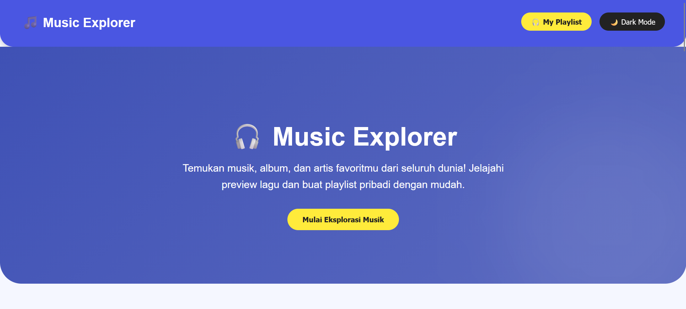
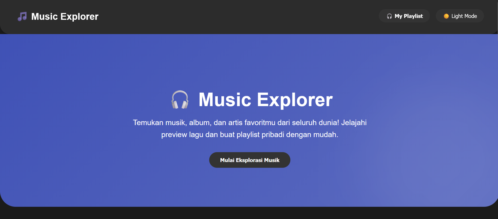
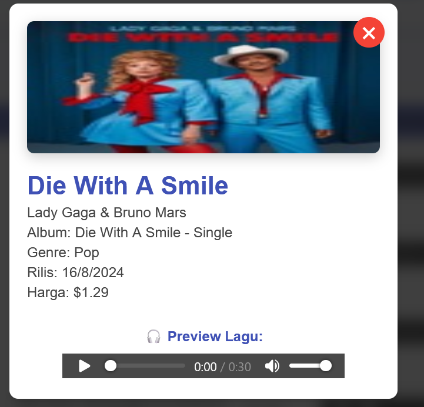
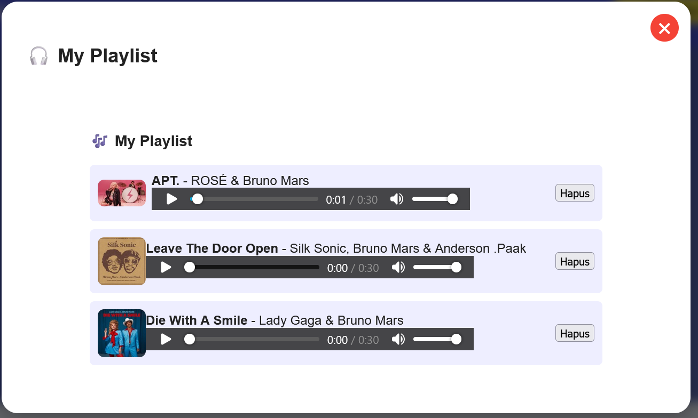

# 🎧 Music Explorer

Nama: Muhammad Riveldo Hermawan Putra
NIM: 122140037

Deskripsi:
Music Explorer adalah aplikasi berbasis web yang memungkinkan pengguna untuk mencari, mendengarkan preview lagu, dan membuat playlist pribadi menggunakan data dari iTunes API.
Aplikasi ini memiliki tampilan modern, fitur dark mode, serta sistem penyimpanan lokal (localStorage) agar data playlist tetap tersimpan meskipun halaman direfresh.

---

## 🧠 Teknologi yang Digunakan

- React.js Framework utama untuk pengembangan UI
- React Hooks (useState, useEffect, useRef)	Manajemen state dan efek samping
- Fetch API	Mengambil data dari iTunes API
- LocalStorage Menyimpan data playlist secara lokal
- React Toastify Menampilkan notifikasi
- CSS3 / Flexbox Styling responsif dan animasi halus

---

## ⚙️ Instruksi Instalasi dan Menjalankan

1. **Clone repository**  
   ```bash
   git clone https://github.com/MuhammadRiveldo/uts-pemweb-122140037.git

2. **Install dependencies**  
   ```bash
   npm install

3. **Menjalankan aplikasi react**  
   ```bash
   npm start

   Aplikasi akan berjalan di http://localhost:3000

4. **Build untuk Production**  
   ```bash
   npm run build

---

## 📸 Screenshot Antarmuka

Berikut ini adalah tampilan dari website Music Explorer halaman Home Tema Terang:
 

Berikut ini adalah tampilan dari website Music Explorer halaman Home Tema Gelap


Berikut ini adalah tampilan dari Hasil Pencarian:
 

Berikut ini adalah tampilan dari Detail Musik:


Berikut ini adalah tampilan dari musik yang sudah di tambah ke MyPlaylist:

---

## 🚀 Fitur Utama

🎵 1. Pencarian Lagu
- Pengguna dapat mencari lagu, album, atau podcast melalui API iTunes.
- Hasil pencarian ditampilkan dalam bentuk tabel interaktif dengan informasi seperti judul, artis, harga, dan audio preview.

💾 2. Playlist Pribadi
- Lagu dapat ditambahkan ke playlist pribadi dengan tombol “+ Playlist"
- Playlist disimpan secara otomatis di localStorage, sehingga tidak hilang saat halaman direfresh.
- Pengguna dapat menghapus lagu dari playlist, dan sistem akan menampilkan notifikasi sukses atau error.

🌙 3. Dark Mode
- Fitur untuk beralih antara Light Mode dan Dark Mode.
- Seluruh elemen UI (tabel, tombol, popup, text) beradaptasi secara dinamis terhadap mode gelap.

🔔 4. Notifikasi Interaktif
- Menggunakan react-toastify untuk menampilkan notifikasi real-time seperti:
- ✅ Lagu berhasil ditambahkan ke playlist
- ⚠️ Lagu sudah ada di playlist

---

## 🌐 Link Deployment
Jika sudah dideploy:

👉 https://uts-pemweb-122140037vercelapp.vercel.app/

---
> Dibuat oleh Muhammad Riveldo Hermawan Putra (122140037)
